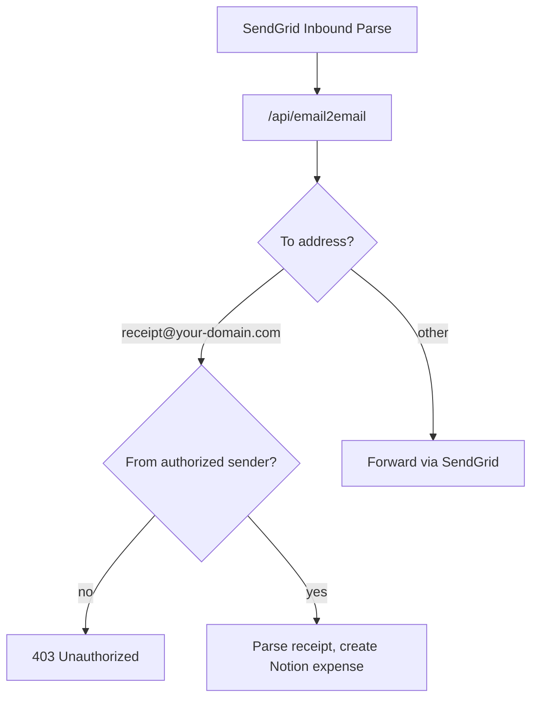

# email2email

A Vercel serverless webhook that receives inbound email from [SendGrid Inbound Parse](https://docs.sendgrid.com/for-developers/parsing-email/setting-up-the-inbound-parse-webhook) and does one of two things:

1. **Forward** most mail to another inbox via SendGrid.
2. **Parse BOC receipt emails** sent to `receipt@your-domain.com` and create rows in a Notion **Expenses** database.

Receipt emails are never forwarded. They are written to Notion only.

## How it works



### Receipt processing

When an email arrives at your configured **`RECEIPT_EMAIL`** from the authorized sender (`RECEIPT_AUTHORIZED_SENDER`):

1. Parse the email body (BOC credit card or BoC Pay+ format)
2. Rename the merchant and set Category when a rule matches
3. Convert foreign currency to HKD using the [Frankfurter API](https://www.frankfurter.app/) (transaction date)
4. Resolve the Wallet relation
5. Find or create Daily / Monthly Expense pages for the transaction date
6. Deduplicate, then create a new Expense row with a matching page icon

Supported BOC email formats:

**Credit card**

```
Card Account Number Ending with: 1110
Transaction Date: 23/06
Merchant Name: AlipayHK*SoFast
Transaction Amount: HKD62.00
```

**BoC Pay+**

```
Top-up Account No. : BOC Card Ending [0112]
Transaction Date : 2026/06/21
Merchant : MT CITYBUS
Amount : HKD 4.40
```

Foreign currencies supported: HKD, CNY/CNH, USD, MYR, SGD.

### Merchant rules

Keyword matching is case-insensitive. First match wins.

| Keyword | Notion name | Category |
|---------|-------------|----------|
| `LCSD`, `SMARTPLAY` | Gym - LCSD | Sports |
| `PARKNSHOP` | ParkNShop | Grocery |
| `CITYBUS` | Citybus | Transport |
| `MTR` | MTR | Transport |
| `TAOBAO` | Taobao | Shopping |

Edit `lib/merchantRules.js` to add more rules.

### Wallet lookup

| Email type | Wallet matched by |
|------------|-------------------|
| Credit card | Notion Wallet name ending with ` - {last4}` (e.g. `Go R - 1110`) |
| BoC Pay+ | Exact name `BoC Pay` |

## Setup

### 1. Deploy to Vercel

Deploy this repo to Vercel. The webhook endpoint is:

```
https://<your-vercel-domain>/api/email2email
```

[`vercel.json`](vercel.json) sets a 30-second function timeout for Notion and FX API calls.

### 2. Configure SendGrid Inbound Parse

In SendGrid, point your inbound parse webhook at the URL above for the domain(s) you receive mail on (e.g. `your-domain.com`).

Set these in Vercel (no code defaults — receipt processing is disabled until both are set):

| Variable | Example | Purpose |
|----------|---------|---------|
| `RECEIPT_EMAIL` | `receipt@your-domain.com` | Must match the SendGrid inbound parse address for receipt mail |
| `RECEIPT_AUTHORIZED_SENDER` | `you@example.com` | Only this sender may trigger BOC receipt parsing |

### 3. Notion integration

1. Create an integration at https://www.notion.so/my-integrations
2. Share these databases with the integration (**⋯ → Connections**):
   - Expenses
   - Wallet
   - Category
   - Daily Expense
   - Monthly Expense
3. Copy the integration secret and your database/page IDs into Vercel env vars (see table below). Find IDs in each Notion database or page URL.

All Notion database and category IDs are required via environment variables (see table below).

### 4. Environment variables

Copy [`.env.example`](.env.example) and set values in Vercel (Production and Preview):

| Variable | Required | Purpose |
|----------|----------|---------|
| `SENDGRID_API_KEY` | Yes | Send forwarded mail |
| `TO_EMAIL_ADDRESS` | Yes | Destination for forwarded mail |
| `NOTION_API_KEY` | Yes | Notion integration for receipt flow |
| `RECEIPT_EMAIL` | Yes | Inbound address for BOC receipt processing (must match SendGrid parse setting) |
| `RECEIPT_AUTHORIZED_SENDER` | Yes | Sender allowed for receipt processing (no code default) |
| `NOTION_EXPENSES_DATABASE_ID` | Yes | Expenses database ID |
| `NOTION_WALLET_DATABASE_ID` | Yes | Wallet database ID |
| `NOTION_DAILY_EXPENSE_DATABASE_ID` | Yes | Daily Expense database ID |
| `NOTION_MONTHLY_EXPENSE_DATABASE_ID` | Yes | Monthly Expense database ID |
| `NOTION_CATEGORY_SPORTS_ID` | Optional | Category page ID for Sports merchants |
| `NOTION_CATEGORY_GROCERY_ID` | Optional | Category page ID for Grocery merchants |
| `NOTION_CATEGORY_TRANSPORT_ID` | Optional | Category page ID for Transport merchants |
| `NOTION_CATEGORY_SHOPPING_ID` | Optional | Category page ID for Shopping merchants |

## Usage

### Forwarding email

Send or forward any email to your configured inbound address **except** your `RECEIPT_EMAIL` address. It will be relayed to `TO_EMAIL_ADDRESS` with the original body and attachments.

Spam from certain TLDs is dropped silently.

### Logging BOC receipts

Forward a BOC transaction notification to your **`RECEIPT_EMAIL`** address from the authorized sender. The app creates a Notion Expense row and returns JSON:

```json
{ "status": "created", "pageId": "...", "name": "Citybus", "date": "2026-06-21", "amountHkd": 4.4 }
```

If the same transaction already exists:

```json
{ "status": "duplicate", "pageId": "..." }
```

Unauthorized senders receive `403` with `{ "status": "error", "message": "Unauthorized receipt sender" }`.

## Local development

```bash
npm install
cp .env.example .env   # fill in values
npm test
vercel dev
```

POST test payloads to `http://localhost:3000/api/email2email` (multipart form fields as SendGrid sends them, or a raw `email` field with RFC 822 content).

Example curl for a receipt (simplified):

```bash
curl -X POST http://localhost:3000/api/email2email \
  -F 'from=Authorized Sender <authorized-sender@example.com>' \
  -F 'to=receipt@your-domain.com' \
  -F 'subject=BOC Transaction' \
  -F 'text=Card Account Number Ending with: 1110
Transaction Date: 23/06
Merchant Name: AlipayHK*SoFast
Transaction Amount: HKD62.00'
```

## Project structure

```
api/
  email2email.js    # SendGrid webhook handler
  index.js          # API root (noindex)
lib/
  receiptHandler.js       # Receipt pipeline orchestration
  parseBocTransaction.js  # BOC email parser
  merchantRules.js        # Merchant rename + category mapping
  exchangeRate.js         # FX conversion
  notionExpense.js        # Notion API (wallet, periods, expenses)
  expenseIcon.js          # Page icon selection
public/
  index.html        # Static landing page
```

## Further reading

See [IMPLEMENTATION.md](IMPLEMENTATION.md) for the full design notes, field mapping, deduplication rules, and API error responses.
